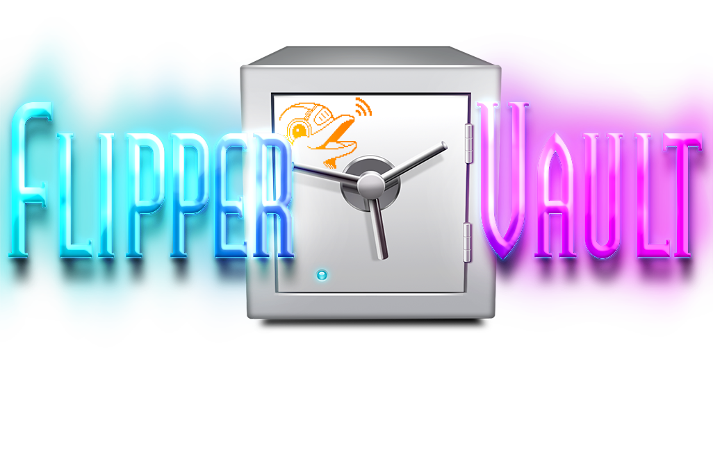

<h1 align="center">Hi 👋, I'm ATOMNFT</h1>
<h3 align="center">A tinkerer from the US. Designing, building and testing are my passions</h3>

<h3 align="center">
  I'm building a collection of Awesome Animations for the <a href="https://flipperzero.one">Flipper Zero</a> device.  
  
</h3>

<table align="center">
<tr>
  <td>
    <h3 align="center">
    👋 New to Flipper Zero?  
    Check out the awesome <a href="https://github.com/djsime1/awesome-flipperzero">page</a> by djsime1! Tons of resources there.
    </h3>
  </td>
  <td>
    <h3 align="center">
    🚫 Doing this for fun. Not affiliated with 
    <a href="https://www.flipperdevices.com/">Flipper Devices Inc.</a>
    </h3>
  </td>
</tr>
</table>

<b>Below you can find links to some great flipper zero resources that have been put together by the great members of the F0 community!
A big thank you to each of you in this awesome community. None of this would be possible if it weren't for you and your awesomeness!</b>

 

## Animations Section.

* [`Talking Sasquach Animations` Dude wrote the book on making shaweeet animations.](https://github.com/skizzophrenic/Talking-Sasquach)
* [`UberGuidoZ Graphics` Some great info on animations, links to resources and more including PYX host.](https://github.com/UberGuidoZ/Flipper/tree/main/Graphics)
* [`Kuronons Graphics` Custom animations, passport backgrounds & profile pictures. Dudes a wiz with F0 animations!](https://github.com/Kuronons/FZ_graphics)
* [`Animations by stopoxy` More great custom animations.](https://github.com/stopoxy/FZAnimations)
* [`Dexv Graphics` Custom animations. Info and resources.](https://github.com/DXVVAY/dexv-graphics)

<h2>Find more great animations and info at <a href="https://github.com/djsime1/awesome-flipperzero">djsime1's page</a></h2>

 

  

  

